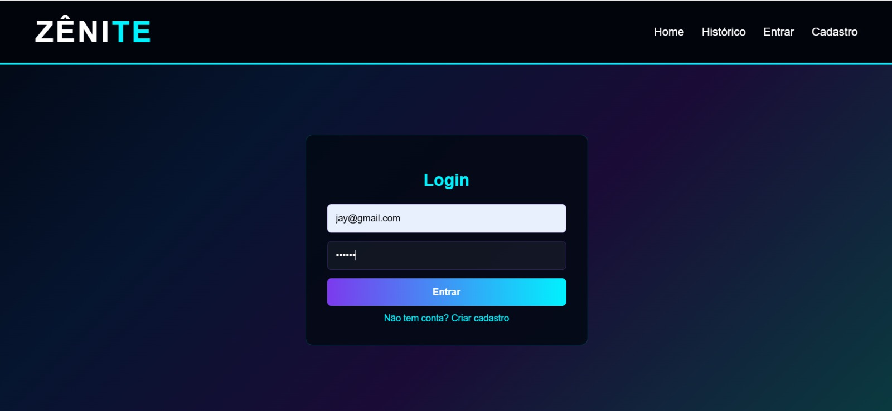
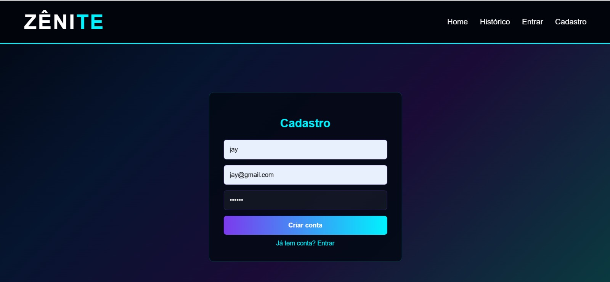
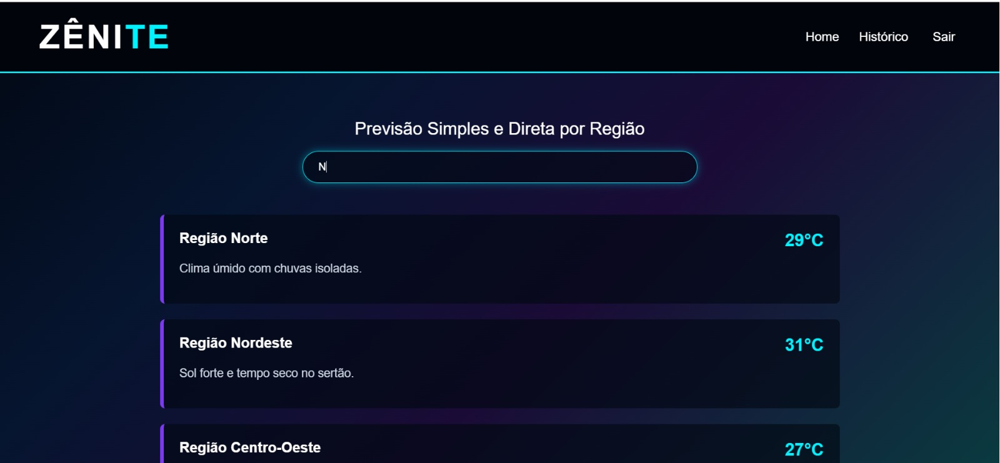
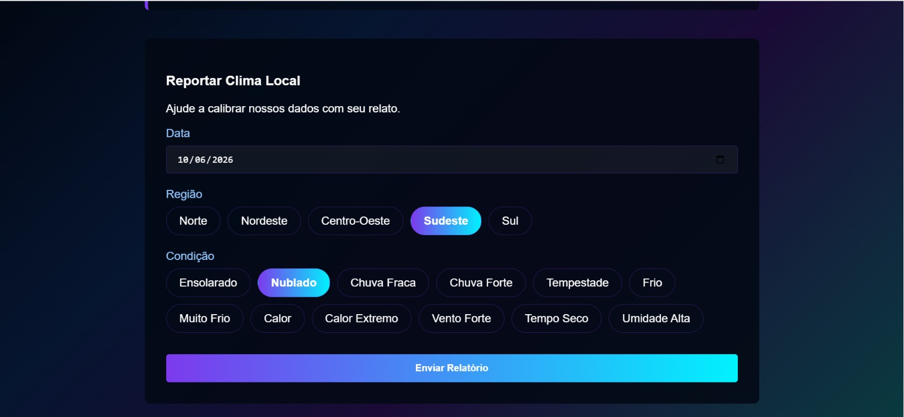
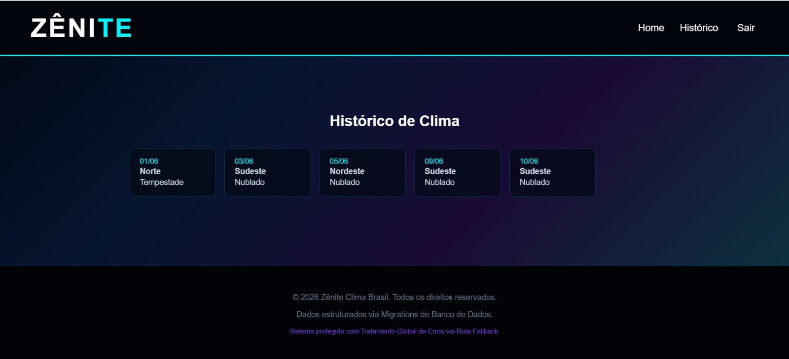
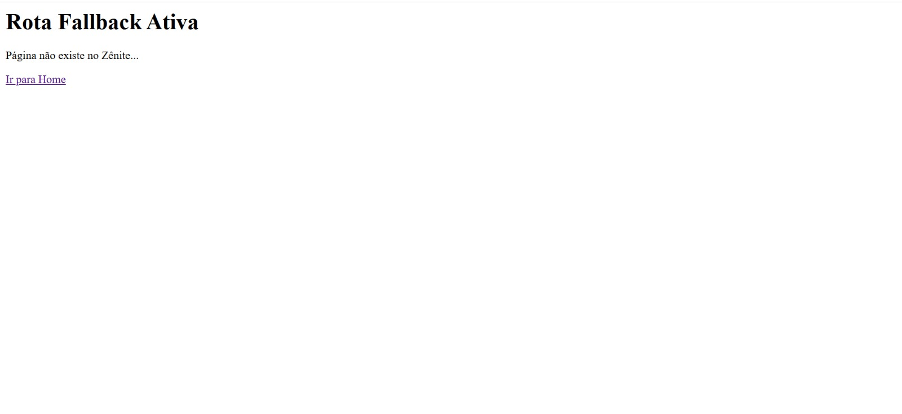

  

<h3 align="center">
  Atividades de 2026 da matéria do curso de Programação de Aplicativos Mobiles III.
</h3>
  

  
# ★ Telas do Projeto - Zênite ★

  

| Tela Login | Tela de Cadastro | Tela Home |
|------------------|--------------------------|-------------------------|
|  |  |  |
 

| Tela Relatótio | Tela do Histórico | Tela FallBack |
|------------------|--------------------------|-------------------------|
|  |  |  |

  

