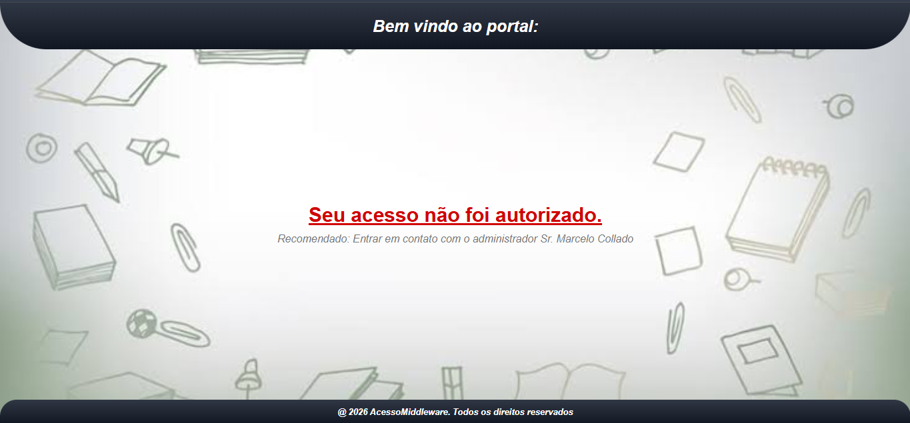

  

<h3 align="center">
  Atividades de 2026 da matéria do curso de Programação de Aplicativos Mobiles III.
</h3>

  

  

# ★ Usando o SEEDER - ativ_seeder ★

 Projeto desenvolvido para a atividade de <strong>Seeders utilizando Laravel</strong>. O objetivo do projeto é criar e preencher um banco de dados utilizando <strong>Migrations, Models, relacionamentos e Seeders</strong>. 
 
 
                                                                                                                                                                                                                                                                                                                                                      

                                                                                                                          
<h2 align="center">Tecnologias utilizadas</h2> 
Laravel - PHP - MySQL - Artisan - phpMyAdmin - Composer - NPM

      

<h2 align="center">1. Criação do projeto</h2> 

 O projeto foi criado utilizando o instalador do Laravel. Primeiramente, foi instalado o Laravel Installer de forma global através do Composer: 

composer global require laravel/installer

 Esse comando instala o <strong>Laravel Installer</strong> globalmente no computador, permitindo criar novos projetos Laravel utilizando o comando <code>laravel new</code>. 
 
Depois, o projeto foi criado com:

laravel new ativ_seeder

 Esse comando cria uma nova aplicação Laravel com o nome <strong>ativ_seeder</strong>, gerando automaticamente a estrutura inicial do projeto. 
 
Após a criação, foi acessada a pasta do projeto:

cd ativ_seeder

 O comando <code>cd</code> é utilizado para acessar a pasta do projeto através do terminal. 

      

<h2 align="center">2. Instalação das dependências e execução</h2> 
 Depois da criação do projeto, foram instaladas as dependências do NPM: 

npm install

 O comando <code>npm install</code> instala as dependências JavaScript definidas no arquivo <code>package.json</code> do projeto. 
 
Em seguida, foi executado:

npm run build

 Esse comando realiza a compilação dos arquivos do front-end, preparando os recursos necessários para a aplicação. 
 
 Por fim, o ambiente de desenvolvimento foi iniciado através de: 

composer run dev

 Esse comando inicia o ambiente de desenvolvimento configurado para a aplicação Laravel. 
 

      

<h2 align="center">3. Configuração do banco de dados</h2> 
 Para o projeto foi utilizado o banco de dados <strong>MySQL</strong>. O banco criado para a aplicação foi: 
 

<strong>ativ_seeder</strong>
 

 A conexão com o banco de dados é configurada no arquivo <code>.env</code> do Laravel. 
 
 As informações utilizadas devem corresponder à configuração do MySQL instalado na máquina. 

DB_CONNECTION=mysql
DB_HOST=127.0.0.1
DB_PORT=3306
DB_DATABASE=ativ_seeder
DB_USERNAME=root
DB_PASSWORD=

 O arquivo <code>.env</code> contém as configurações específicas do ambiente da aplicação, incluindo os dados necessários para que o Laravel consiga acessar o banco de dados. 
 

      

<h2 align="center">4. Migrations</h2> 
 As <strong>Migrations</strong> são utilizadas pelo Laravel para criar e modificar a estrutura do banco de dados através de código PHP. 
 
 Neste projeto foram utilizadas três tabelas principais: 

<code>users</code> — responsável pelos usuários;

<code>generos</code> — responsável pelos gêneros literários;

<code>livros</code> — responsável pelos livros cadastrados.

<h3>Tabela users</h3> 
 A tabela <code>users</code> armazena os usuários cadastrados no sistema. Ela possui informações como nome, e-mail, senha e datas de criação e atualização. 
 <h3>Tabela generos</h3> 
 A tabela <code>generos</code> armazena os gêneros literários disponíveis no sistema. 
 
Os gêneros utilizados foram:

Romance

Ficção Científica

Fantasia

Terror

Aventura

<h3>Tabela livros</h3> 
 A tabela <code>livros</code> armazena os livros cadastrados. Além das informações do livro, ela possui uma chave estrangeira que identifica o gênero ao qual o livro pertence. 

      

 <h2 align="center">5. Relacionamento entre as tabelas</h2> 
 O projeto possui um relacionamento entre as tabelas <strong>generos</strong> e <strong>livros</strong>. 
 
O relacionamento utilizado é:
 
 <strong>Um gênero possui vários livros.</strong>  <strong>Um livro pertence a um gênero.</strong> 
 
 Esse tipo de relacionamento é conhecido como <strong>One-to-Many (um para muitos)</strong>. 
 <h3>Exemplo</h3> 
 Um gênero pode possuir vários livros. Por exemplo, o gênero Romance pode estar relacionado a diferentes livros: 

 Romance 

├── Orgulho e Preconceito

├── O Morro dos Ventos Uivantes

└── Os Noivos do Inverno

 Ao mesmo tempo, cada livro pertence a apenas um gênero. Por exemplo: 

Os Noivos do Inverno
        ↓
     Romance

 Para realizar esse relacionamento no banco de dados, a tabela <code>livros</code> possui uma chave estrangeira que referencia a tabela <code>generos</code>. 
 
 Essa chave estrangeira permite identificar a qual gênero cada livro pertence. 
 <h3>Relacionamento nos Models</h3> 
 O Laravel também permite representar esse relacionamento através dos Models. 
 
 No Model <code>Genero</code>, é utilizado o relacionamento <code>hasMany</code>, indicando que um gênero possui vários livros: 

public function livros()
{
    return $this->hasMany(Livro::class);
}

 No Model <code>Livro</code>, é utilizado o relacionamento <code>belongsTo</code>, indicando que um livro pertence a um gênero: 

public function genero()
{
    return $this->belongsTo(Genero::class);
}

 Dessa maneira, o relacionamento existe tanto no banco de dados, através da chave estrangeira, quanto nos Models do Laravel. 
 
A partir de um gênero, é possível acessar seus livros:

$genero->livros

E, a partir de um livro, é possível acessar seu gênero:

$livro->genero

      

<h2 align="center">6. Criação dos Seeders</h2> 
 Os <strong>Seeders</strong> são recursos do Laravel utilizados para inserir dados automaticamente no banco de dados. 
 
 Eles são úteis durante o desenvolvimento e os testes, pois permitem cadastrar vários registros automaticamente, sem precisar inserir cada informação manualmente pelo banco. 
 
Neste projeto foram criados três Seeders:

php artisan make:seeder UserSeeder
php artisan make:seeder GeneroSeeder
php artisan make:seeder LivroSeeder

<h3>➔ UserSeeder</h3> 
O comando:

php artisan make:seeder UserSeeder

 cria o arquivo <code>UserSeeder.php</code> dentro da pasta: 

database/seeders

 Esse Seeder é responsável por inserir os usuários iniciais no banco de dados. 
 
Foram cadastrados:

Jayane Elias
João Silva
Maria Santos
Pedro Oliveira

 O <code>UserSeeder</code> automatiza a inserção desses usuários. Assim, quando o Seeder é executado, os registros definidos no arquivo são inseridos no banco. 
 
<h3> ➔ GeneroSeeder</h3> 
O comando:

php artisan make:seeder GeneroSeeder

 cria o arquivo <code>GeneroSeeder.php</code>. 
 
 Esse Seeder é responsável por inserir os gêneros literários utilizados no projeto. 
 
Foram cadastrados:

Romance

Ficção Científica

Fantasia

Terror

Aventura

<h3>➔ LivroSeeder</h3> 

O comando:

php artisan make:seeder LivroSeeder

 cria o arquivo <code>LivroSeeder.php</code>. 
 
 Esse Seeder é responsável por inserir os livros no banco de dados. 
 
Foram cadastrados:

Orgulho e Preconceito

O Morro dos Ventos Uivantes

Duna

O Senhor dos Anéis

Drácula

As Aventuras de Tom Sawyer

Os Noivos do Inverno

 Além do nome do livro, o <code>LivroSeeder</code> também deve informar o gênero ao qual cada livro pertence. Essa informação é armazenada através da chave estrangeira da tabela <code>livros</code>. 
 

      

<h2 align="center">7. Execução dos Seeders</h2> 
 Depois da criação das Migrations e dos Seeders, foi utilizado o comando: 

php artisan migrate:fresh --seed

<h3>migrate:fresh</h3> 
 O comando <code>migrate:fresh</code> apaga todas as tabelas existentes no banco de dados e executa novamente todas as Migrations. 
 
 Isso permite recriar o banco de dados do zero, garantindo que sua estrutura esteja de acordo com as Migrations atuais. 
 <h3>--seed</h3> 
 A opção <code>--seed</code> informa ao Laravel que, depois de executar as Migrations, os Seeders também devem ser executados. 
 
Dessa forma, o processo realizado é:

Apagar as tabelas existentes
          ↓
Criar as tabelas novamente
          ↓
Executar os Seeders
          ↓
Inserir os dados

 Assim, ao executar: 

php artisan migrate:fresh --seed

 o banco é recriado e preenchido automaticamente com os usuários, gêneros e livros definidos nos Seeders. 

      
<h2 align="center">8. Dados inseridos</h2> <h3>Usuários</h3>

João Silva

Maria Santos

Pedro Oliveira

Jayane Elias

<h3>Gêneros</h3>

Romance

Ficção Científica

Fantasia

Terror

Aventura

<h3>Livros</h3>
Os Noivos do Inverno
Orgulho e Preconceito
O Morro dos Ventos Uivantes
Duna
O Senhor dos Anéis
Drácula
As Aventuras de Tom Sawyer

 O livro <strong>Os Noivos do Inverno</strong> foi relacionado ao gênero correspondente através da chave estrangeira existente na tabela <code>livros</code>. 
 <h2 align="center">9. Validação dos dados</h2> 
 Após a execução dos Seeders, os dados foram conferidos através do <strong>phpMyAdmin</strong>. 
 
 Foi verificado se as tabelas foram criadas corretamente e se os registros foram inseridos no banco de dados. 
 
 Também foram verificadas as relações entre os livros e seus respectivos gêneros. 
 
 Para visualizar os livros juntamente com seus gêneros, pode ser utilizada a seguinte consulta SQL: 

SELECT livros.titulo, generos.nome AS genero
FROM livros
INNER JOIN generos
ON livros.genero_id = generos.id;

 Essa consulta utiliza um <code>INNER JOIN</code> para relacionar os registros da tabela <code>livros</code> com os registros da tabela <code>generos</code>. 
 
 O resultado permite verificar qual gênero está associado a cada livro. 
 

      

<h2 align="center">10. Dump do banco de dados</h2> 
 Após a criação e validação do banco de dados, foi realizada a exportação das informações. 
 
 O banco foi exportado para o arquivo: 
 

<strong>ativ_seeder.sql</strong>
 
 Esse arquivo contém a estrutura e os dados do banco de dados e pode ser utilizado para importar o projeto em outro ambiente. 
 

      

<h2 align="center">11. Estrutura final do projeto</h2> 
 A estrutura principal utilizada no projeto pode ser representada da seguinte maneira: 

◈ Laravel: ◈

  
➣ Migrations
users
generos
livros
  
➣ Models
 User
 Genero
 Livro
   
➣ Seeders
UserSeeder
GeneroSeeder
LivroSeeder

 As <strong>Migrations</strong> definem a estrutura do banco, os <strong>Models</strong> representam as tabelas e seus relacionamentos dentro do Laravel, e os <strong>Seeders</strong> são responsáveis por preencher o banco com os dados iniciais. 
 
 Dessa forma, utilizando: 

php artisan migrate:fresh --seed

 é possível recriar toda a estrutura do banco e inserir automaticamente os dados necessários para o projeto. 

      

 <h2>Desenvolvido para a atividade de Seeders — Laravel</h2> 

  

# ★ AMS Laravel - Middleware ★

  

 Referente à aula 26.08 

     

  

# ★ AMS Laravel - Mapeamento ★

  

 Referente à aula 19.08 

  <h3> Projeto de Mapeamento Objeto-Relacional em Tempo Real, utilizando o Laravel e o MySQL. Definimos algumas entidades básicas para demonstrar o relacionamento entre elas.
</h3>

## As Tabelas são:

**Users:** *armazena e registra os usuários.*

**Profiles:** *armazena o perfil que o usuário possui.*

**Posts:** *armazena as publicações e conteúdos dos usuários.*

**Tags:** *armazena tags (tópicos) de interesse dos usuários.*

 

## Relacionamentos:
**Tabela users 1 — 1 Tabela profiles**

**Tabela users 1 — N Tabela posts**

**Tabela posts N — M Tabela tags**, utilizando a tabela `post_tag` como tabela pivô.

 

  

# ★ Telas do Projeto - ETEC ★

  

| Tela de Login | Tela de Cadastro |
|---------------|------------------|
|  |  |

 

| Tela Home | Tela Cursos | Tela Eventos |
|-----------|-------------|--------------|
|  |  |  |

 

| Tela Sobre | Tela Fallback |
|------------|---------------|
|  |  |

  

##

  

# ★ Telas do Projeto - Zênite ★

  

| Tela Login | Tela de Cadastro | Tela Home |
|------------------|--------------------------|-------------------------|
|  |  |  |
 

| Tela Relatótio | Tela do Histórico | Tela FallBack |
|------------------|--------------------------|-------------------------|
|  |  |  |

  

