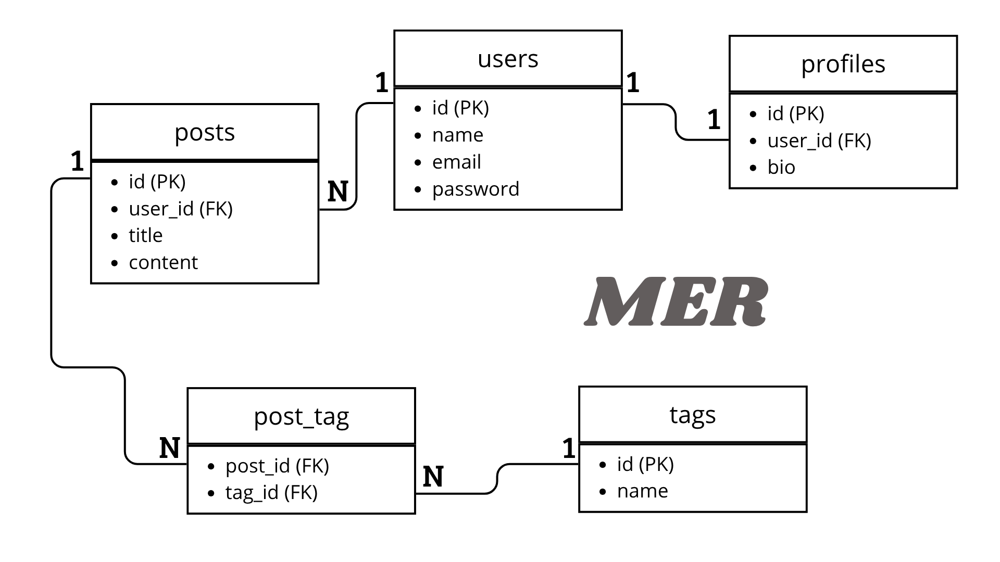
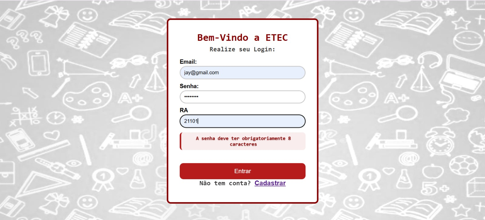
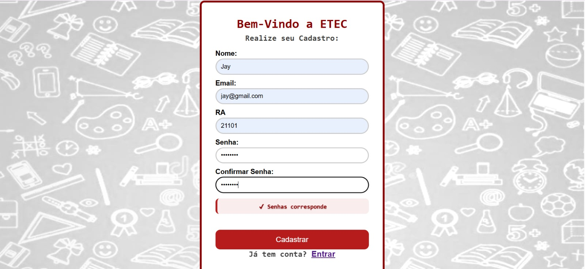
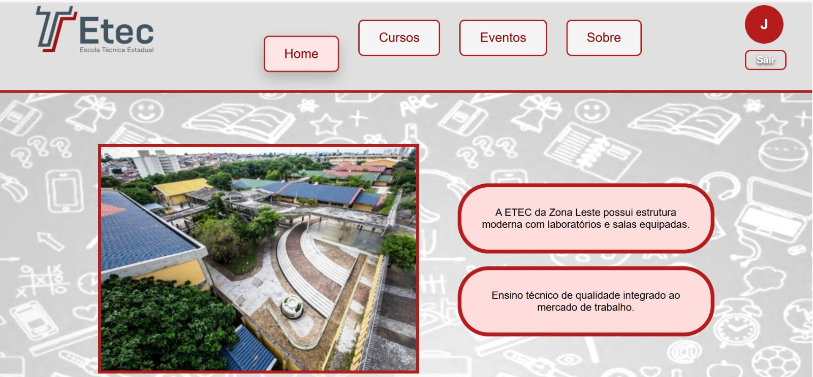
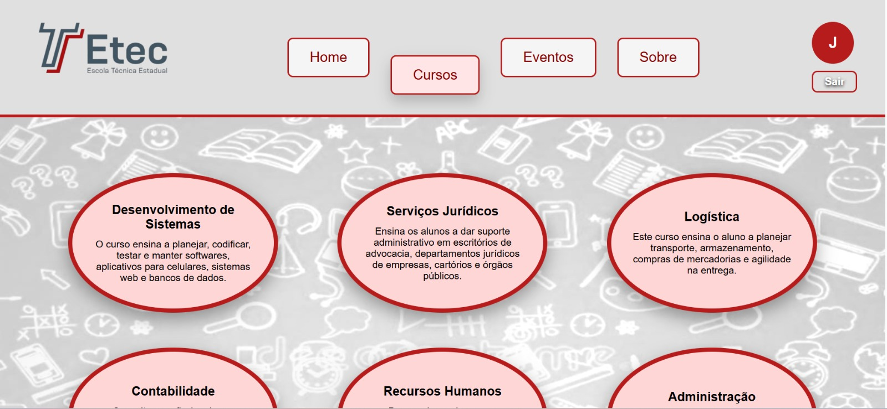
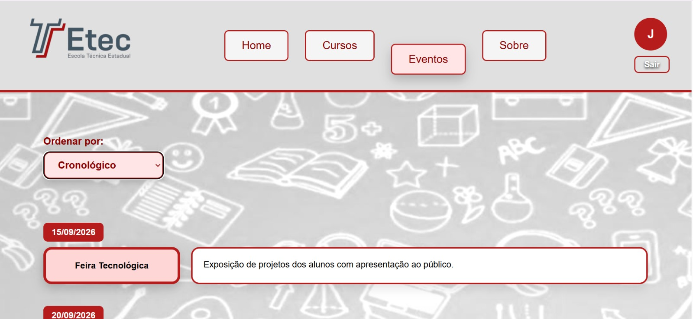
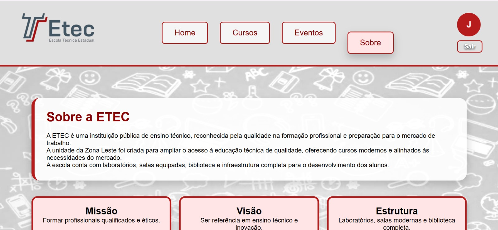
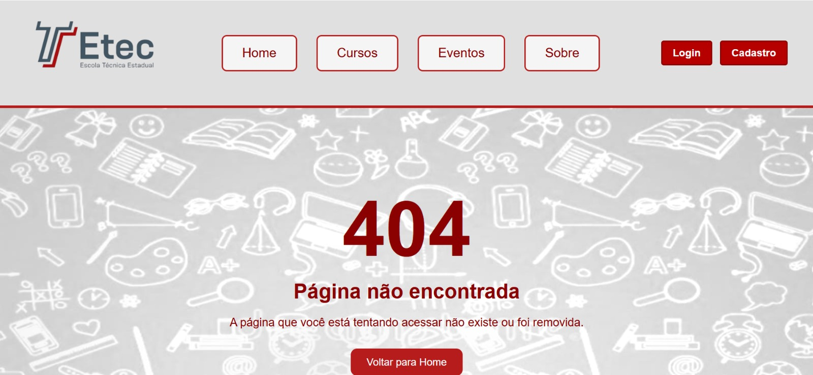

  

<h3 align="center">
  Atividades de 2026 da matéria do curso de Programação de Aplicativos Mobiles III.
</h3>

  

# ★ AMS Laravel - Mapeamento ★

  

 Referente à aula 19.08 

  <h3> Projeto de Mapeamento Objeto-Relacional em Tempo Real, utilizando o Laravel e o MySQL. Definimos algumas entidades básicas para demonstrar o relacionamento entre elas.
</h3>

## As Tabelas são:

**Users:** *armazena e registra os usuários.*

**Profiles:** *armazena o perfil que o usuário possui.*

**Posts:** *armazena as publicações e conteúdos dos usuários.*

**Tags:** *armazena tags (tópicos) de interesse dos usuários.*

 

## Relacionamentos:
**Tabela users 1 — 1 Tabela profiles**

**Tabela users 1 — N Tabela posts**

**Tabela posts N — M Tabela tags**, utilizando a tabela `post_tag` como tabela pivô.

 

  

# ★ Telas do Projeto - ETEC ★

  

| Tela de Login | Tela de Cadastro |
|---------------|------------------|
|  |  |

 

| Tela Home | Tela Cursos | Tela Eventos |
|-----------|-------------|--------------|
|  |  |  |

 

| Tela Sobre | Tela Fallback |
|------------|---------------|
|  |  |

  

##

  

# ★ Telas do Projeto - Zênite ★

  

| Tela Login | Tela de Cadastro | Tela Home |
|------------------|--------------------------|-------------------------|
|  |  |  |
 

| Tela Relatótio | Tela do Histórico | Tela FallBack |
|------------------|--------------------------|-------------------------|
|  |  |  |

  

